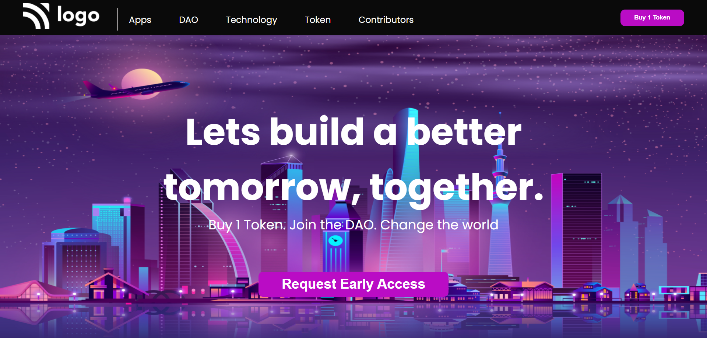

# Hey Welcome

Hi, My name is Uvesh Khatri and I have completed the 5th Project of the iNeuron Full Stack Course.

# Project 5

In this project i have created a Crypto Landing Home Page. And i have learnt a lot of things like Position.

It took me 4  Hours to complete this project
## Tech Stack Used 
- HTML5

- CSS

## My Project is looking like :

[Live Link](https://uveshkhatri-crypto-landing-page.netlify.app/)